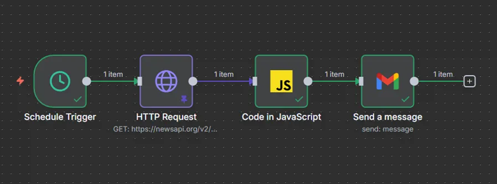

# 20251205_AI_Workshop
- [VBA](#VBA)
    - [reference VBA script](#reference-VBA-script)
- [n8n cloud news feed](#n8n-cloud-news-feed)
    - [Links](#links)
    - [n8n flow nodes](#n8n-flow-nodes)
    - [prompt for Javascript](#prompt-for-javascript)
    - [reference Javascript](#reference-javascript)

## VBA
### reference prompt for VBA

```plain_text
Your Task:
- Write a VBA macro for Excel named Save_As_PDF. The macro must export only the ActiveSheet print area as a PDF file.


Function of the VBA marco includes:
1. construct the PDF filename dynamically using values from specific named ranges on the worksheet:
"Assessment Form_"
Followed by the value in named range name_class
Then "_L" followed by the value in named range no_lesson
Then "_" followed by the value in named range date (which must be formatted as yyyymmdd)
Then "_" followed by the value in named range name_initial_assessor
Final extension: .pdf
Example result: Assessment Form_Grade5_L03_20251126_JK.pdf

2. before exporting, set the ActiveSheet page margins to 0.5 inches on all four sides (Top, Bottom, Left, Right) and header/footer margins to 0.3 inches using Application.InchesToPoints.
Export the ActiveSheet as PDF using ExportAsFixedFormat with these settings:
- quality standard
- don't open the pdf after publish

3. store the pdf using the folder path value in named range path_file

4. after successful export, display a message box with title "PDF Ready" and text: "The PDF has been successfully saved as:" followed by the full file path.

The VBA format:
- use meaningful variable names (e.g., FilePath, FileName, FormattedDate, FDialog)
- include comments explaining key steps
- ensure the code handles cancellation gracefully and does not throw errors if the user cancels the folder selection.

```

### reference prompt for error handling

```plain_text
when I paste your generated code and excecute the marco, followuing error messages show:

Also the debugger hightlighted following code:


Guide me how to solve the error and provide the revised VBA script.

```

### reference VBA script

```vba
Sub Save_As_PDF()
    '====================================================================
    ' Macro: Save_As_PDF
    ' Purpose: Export the ActiveSheet's Print Area as a PDF with dynamic filename
    '          using named ranges and fixed page margins
    '====================================================================
    
    Dim ws As Worksheet
    Dim FileName As String
    Dim FormattedDate As String
    Dim FullFilePath As String
    Dim SaveFolder As String
    Dim rng As Range
    
    On Error GoTo ErrorHandler
    
    Set ws = ActiveSheet
    
    '--- 1. Get values from named ranges (with error checking) ----------------
    With ws
        If Not Evaluate("ISREF(name_class)") Then GoTo MissingName
        If Not Evaluate("ISREF(no_lesson)") Then GoTo MissingName
        If Not Evaluate("ISREF(date)") Then GoTo MissingName
        If Not Evaluate("ISREF(name_initial_assessor)") Then GoTo MissingName
        If Not Evaluate("ISREF(path_file)") Then GoTo MissingName
        
        SaveFolder = Trim(.Range("path_file").Value)
        
        ' Ensure folder path ends with a backslash
        If Right(SaveFolder, 1) <> "\" Then SaveFolder = SaveFolder & "\"
        
        ' Format the date as yyyymmdd
        If IsDate(.Range("date").Value) Then
            FormattedDate = Format(.Range("date").Value, "yyyymmdd")
        Else
            MsgBox "The named range 'date' does not contain a valid date.", vbCritical, "Invalid Date"
            Exit Sub
        End If
        
        '--- 2. Build the filename ------------------------------------------------
        FileName = "Assessment Form_" & _
                   Trim(.Range("name_class").Value) & "_" & _
                   "L" & Format(Val(.Range("no_lesson").Value), "00") & "_" & _
                   FormattedDate & "_" & _
                   Trim(.Range("name_initial_assessor").Value) & ".pdf"
        
        FullFilePath = SaveFolder & FileName
    End With
    
    '--- 3. Set page margins (0.5" all sides, 0.3" header/footer) ---------------
    With ws.PageSetup
        .LeftMargin = Application.InchesToPoints(0.5)
        .RightMargin = Application.InchesToPoints(0.5)
        .TopMargin = Application.InchesToPoints(0.5)
        .BottomMargin = Application.InchesToPoints(0.5)
        .HeaderMargin = Application.InchesToPoints(0.3)
        .FooterMargin = Application.InchesToPoints(0.3)
        .CenterHorizontally = True   ' Optional: nice centering
    End With
    
    '--- 4. Export only the Print Area as PDF ----------------------------------
    ws.ExportAsFixedFormat _
        Type:=xlTypePDF, _
        FileName:=FullFilePath, _
        Quality:=xlQualityStandard, _
        IncludeDocProperties:=True, _
        IgnorePrintAreas:=False, _      ' False = respect Print Area
        OpenAfterPublish:=False
    
    '--- 5. Success message -----------------------------------------------------
    MsgBox "The PDF has been successfully saved as:" & vbCrLf & vbCrLf & _
           FullFilePath, vbInformation, "PDF Ready"
    
    Exit Sub

'====================================================================
' Error Handling
'====================================================================
MissingName:
    MsgBox "One or more required named ranges are missing:" & vbCrLf & _
           "name_class, no_lesson, date, name_initial_assessor, path_file", _
           vbCritical, "Named Range Error"
    Exit Sub
    
ErrorHandler:
    If Err.Number = 1004 Then
        ' Common error: Print area not set or file access issue
        MsgBox "Error saving PDF. Possible causes:" & vbCrLf & _
               "- Print area is not defined on this sheet" & vbCrLf & _
               "- Folder path is invalid or not accessible" & vbCrLf & _
               "- File is already open by another program", vbCritical, "Export Failed"
    Else
        MsgBox "Error " & Err.Number & ": " & Err.Description, vbCritical, "Unexpected Error"
    End If
End Sub

```

## n8n cloud news feed
### Links
- n8n cloud: https://n8n.io/
- News API Website: https://newsapi.org/
- News API URL: https://newsapi.org/v2/everything
- News API docs: https://newsapi.org/docs/endpoints/everything

> Website: for create account
>
> URL: for n8n nodes
>
> docs: for checking parameters


### n8n flow nodes


### prompt for Javascript
```plain_text
You are an expert n8n workflow developer.
Write JavaScript code for an n8n "Function" node that processes NewsAPI JSON input
(exactly one item containing { status, totalResults, articles: [...] }).
The code must generate a plain-text email body with this exact format for every article:
title: <title>
link: <url>
date: YYYY-MM-DD
abstract: <clean abstract or content, HTML stripped, [+1234 chars] removed>
<blank line>
--------------------------------------------------
<blank line>

Requirements:
- Use description if present and non-empty, otherwise fall back to content
- Strip all HTML tags
- Remove any "[ +1234 chars]" or similar
- Collapse multiple whitespace to single space
- Format publishedAt as YYYY-MM-DD
- Use real \r\n (CRLF) line endings that survive Gmail
- Remove the final trailing separator
- Return exactly one item with a property called "emailText" containing the full string

CRITICAL: The code MUST work when the Gmail node uses "Text" mode and keep every line separate.
Therefore you MUST:
  • Build the string by concatenating with += and literal \r\n
  • Return using this exact pattern:
    return [{ json: { emailText: finalString } }];
  • NOT use items[0].json + array.join()
Do not wrap in markdown, explain the code, output only the pure working JavaScript code.

```


### reference Javascript
```javascript
let finalString = '';

const data = items[0].json;

if (data.status === 'ok' && data.articles && data.articles.length > 0) {
    data.articles.forEach((article, index) => {
        const title = article.title || '(No title)';
        const url = article.url || '';
        const rawDate = article.publishedAt || '';
        const date = rawDate ? rawDate.split('T')[0] : '(No date)';

        let text = '';
        if (article.description && article.description.trim() !== '') {
            text = article.description;
        } else if (article.content && article.content.trim() !== '') {
            text = article.content;
        }

        // Strip HTML tags
        text = text.replace(/<[^>]*>/g, ' ');

        // Remove [+1234 chars] and similar
        text = text.replace(/\[\s*\+\d+\s*(chars?|characters?)\s*\]/gi, '');

        // Collapse whitespace
        text = text.replace(/\s+/g, ' ').trim();

        finalString += `title: ${title}\r\n`;
        finalString += `link: ${url}\r\n`;
        finalString += `date: ${date}\r\n`;
        finalString += `abstract: ${text}\r\n`;
        finalString += `\r\n`;
        finalString += `--------------------------------------------------\r\n`;
        finalString += `\r\n`;
    });

    // Remove the very last separator and its blank lines
    if (finalString.endsWith('\r\n--------------------------------------------------\r\n\r\n')) {
        finalString = finalString.slice(0, -('--------------------------------------------------\r\n\r\n'.length + 2));
    } else if (finalString.endsWith('\r\n--------------------------------------------------\r\n')) {
        finalString = finalString.slice(0, -('--------------------------------------------------\r\n'.length + 2));
    }
}

return [{ json: { emailText: finalString } }];
```